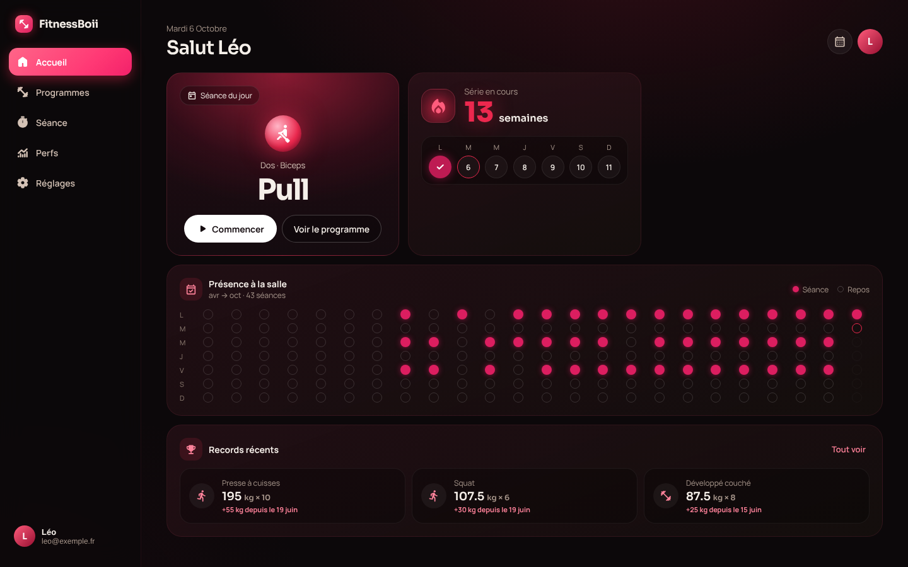
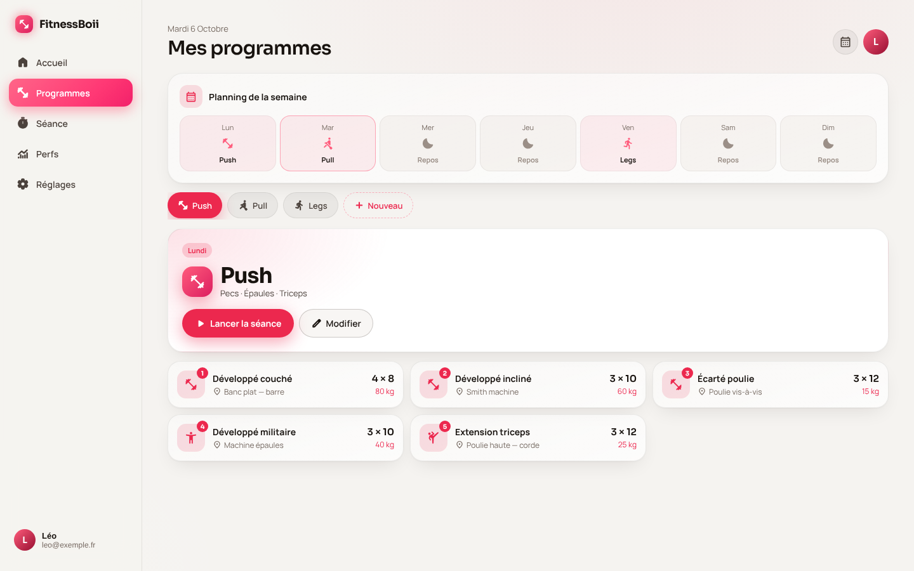

<div align="center">


# FitnessBoii

**Chaque séance compte.**

Application de suivi de musculation : tes programmes, tes perfs et ta régularité au même endroit.

[](https://github.com/YanzBoii/fitnessboii/actions/workflows/ci.yml)


<picture>
  <source media="(prefers-color-scheme: dark)" srcset="docs/screenshots/showcase-dark.png">
  
</picture>

</div>

## Le concept

À la salle, on oublie vite ce qu'on a soulevé la semaine dernière, et la régularité se perd sans qu'on s'en rende compte. FitnessBoii garde tout ça pour toi.

1. **Tes programmes** (Push, Pull, Legs…) sont calés sur tes jours d'entraînement : exercices, machine, séries × reps × charge.
2. **Pendant la séance**, l'app te guide un exercice à la fois, reprend ta dernière perf et lance le minuteur de repos.
3. **Après**, tu vois ta progression : records, série de semaines, présence à la salle et photo de la semaine.

Un questionnaire au premier lancement (objectif, niveau, mensurations, jours d'entraînement) répartit automatiquement les programmes sur la semaine.

## Fonctionnalités

- 🏋️ **Séance guidée** : un exercice à la fois, charge et reps pré-remplies avec ta dernière perf, record affiché
- ⏱️ **Chrono et minuteur de repos** automatique (60 s à 3 min, +15 s, passer)
- 🗓️ **Programmes éditables** et planning de la semaine : exercices, machine, muscles, jours
- 🔥 **Régularité** : série de semaines, heatmap de présence, objectif de séances par semaine
- 🏆 **Records** : perf max par exercice, progression sur 30 jours, records récents
- 📸 **Évolution physique** : une photo par semaine, comparatif début / aujourd'hui ou mois par mois
- 🔐 **Comptes** email (avec vérification) ou Google ; chacun ne voit que ses données
- 📱 **PWA installable** sur iPhone, Android et PC, utilisable hors ligne à la salle
- 🎨 **6 thèmes de couleur**, mode clair / sombre, interface responsive (nav flottante mobile, sidebar desktop)
- 📤 **Export JSON** de toutes les données, suppression complète du compte

<table>
  <tr>
    <td></td>
    <td></td>
  </tr>
</table>

## Stack

| | |
|---|---|
| **Front** | React 18, TypeScript strict, Vite |
| **PWA** | vite-plugin-pwa (Workbox), cache hors ligne |
| **Back** | Firebase Auth (Google + email), Cloud Firestore (cache persistant hors ligne) |
| **Sécurité** | Règles Firestore testées, App Check (reCAPTCHA v3), en-têtes HTTP stricts |
| **Hébergement** | Netlify |
| **Tests / CI** | Vitest (logique métier) + émulateur Firestore (règles), GitHub Actions |

Coût : 0 € (Firebase forfait Spark, Netlify gratuit).

## Points techniques

- **Données isolées et validées** : chaque utilisateur n'accède qu'à `users/{son uid}` ; les règles vérifient champs, types, bornes et formats. Elles sont testées contre l'émulateur à chaque push.
- **Photos privées sans Storage** : compressées dans le navigateur (720 px, l'original n'est jamais envoyé), stockées en octets dans Firestore et lisibles uniquement par leur propriétaire.
- **Hors ligne** : cache Firestore persistant ; la séance en cours est sauvegardée et reprise après fermeture, même sur un autre appareil.
- **Écritures groupées** : les saisies s'affichent tout de suite et partent dans Firestore avec un léger délai, pas une écriture par frappe.
- **Aucune donnée dupliquée** : série, présence, graphiques et records sont recalculés depuis l'historique des séances.
- **Rendu séparé de la logique** : chaque écran = une vue pure + un hook qui calcule ce qu'elle affiche.

Détails (modèle de données, sécurité) dans [docs/architecture.md](docs/architecture.md).

## Lancer le projet

**Avec les émulateurs** (aucun projet Firebase requis, Java 21+) :

```bash
npm install
npm run emulators   # terminal 1
npm run dev:emu     # terminal 2
```

**Avec un vrai projet Firebase** : copier `.env.example` en `.env`, le remplir, puis `npm run dev`.

Le pas-à-pas complet (Firebase, Netlify, App Check) est dans [SETUP.md](SETUP.md).

```bash
npm test            # tests unitaires (dates, stats, séance, normalisation)
npm run test:rules  # règles Firestore sur l'émulateur (Java 21 requis)
npm run build       # build de production
```

## Structure

```
src/
├── domain/      # logique pure testée : dates, stats, séance, normalisation
├── firebase/    # config, auth, accès Firestore, photos
├── state/       # données temps réel, état partagé, toasts
├── ui/          # thèmes, animations, styles globaux
└── features/    # un dossier par écran (Accueil, Programmes, Séance, Perfs…)
design/          # prototype de design d'origine
firestore.rules  # règles de sécurité
```

## Crédits

Design et conception de l'interface : [YanzBoii](https://github.com/YanzBoii).

## Licence

[MIT](LICENSE)
