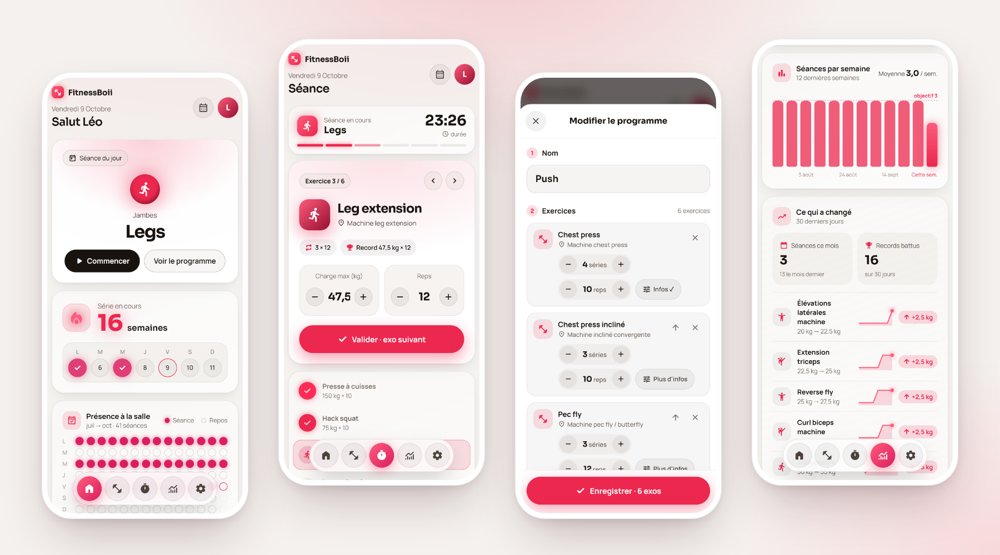
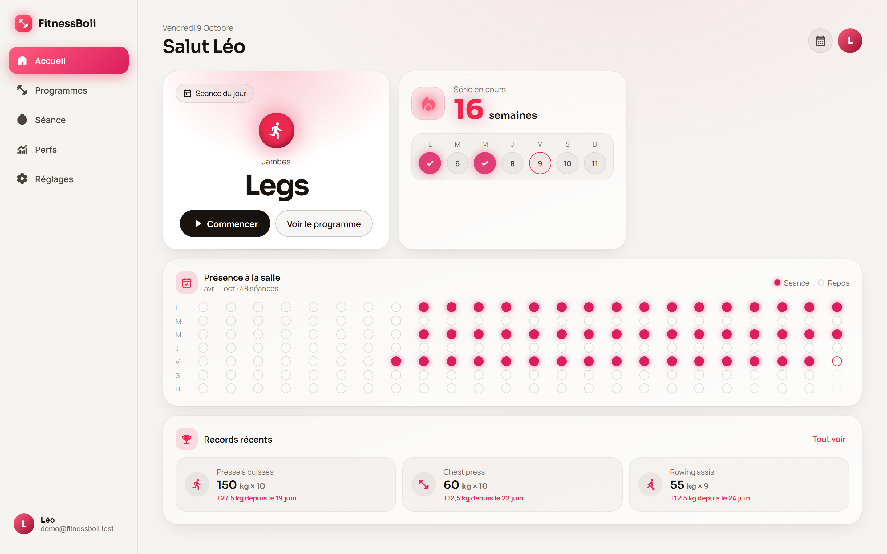
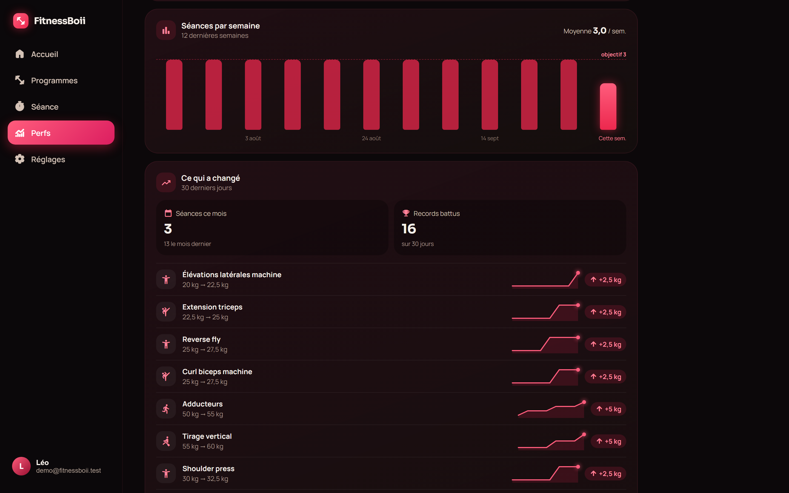
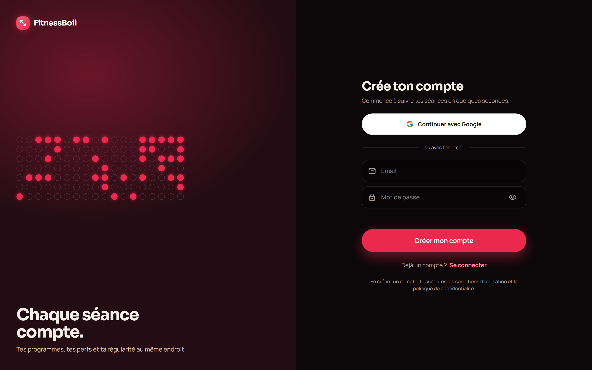
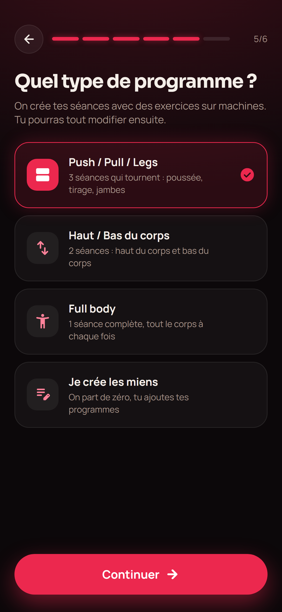
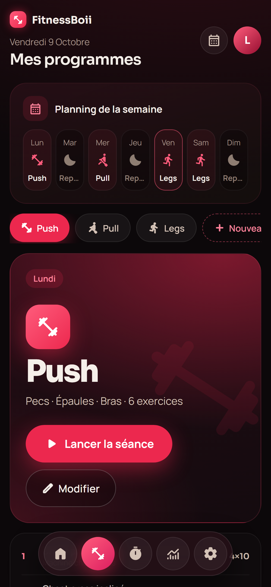
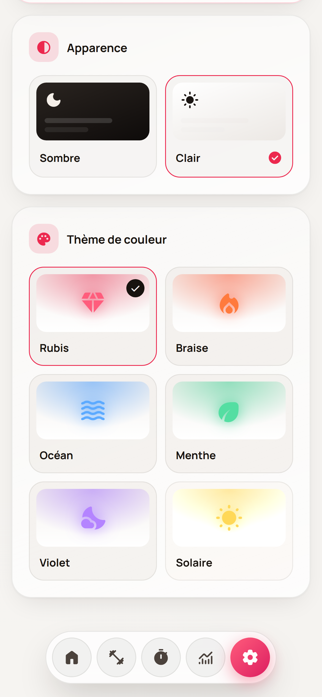

<div align="center">


# FitnessBoii

**Chaque séance compte.**

Application de suivi de musculation : tes programmes, tes perfs et ta régularité au même endroit.

[**Essayer l'app →**](https://fitnessboiii.netlify.app)

[](https://github.com/YanzBoii/fitnessboii/actions/workflows/ci.yml)


<picture>
  <source media="(prefers-color-scheme: dark)" srcset="docs/screenshots/showcase-dark.png">
  
</picture>

</div>

## Le concept

À la salle, on veut savoir quoi faire, sur quelle machine, et à quelle charge on s'était arrêté. FitnessBoii garde tout ça dans la poche.

1. **Un programme en 30 secondes** : choisis un split (Push / Pull / Legs, Haut / Bas, Full body) ou compose le tien depuis une bibliothèque de ~55 exercices sur machines.
2. **Une séance guidée**, un exercice à la fois : la charge de la dernière fois est déjà pré-remplie, tu valides, le minuteur de repos se lance.
3. **Tes progrès sans effort** : records, régularité, ce qui a changé ce mois-ci, et ta photo de la semaine pour comparer.

## Fonctionnalités

- 🏋️ **Programmes** : bibliothèque d'exercices (recherche, filtres par muscle), modèles prêts à l'emploi, exercices perso, réglage machine et repos par exercice
- ⏱️ **Séance guidée** : chrono, minuteur de repos automatique, note de l'exercice (« siège cran 4 »), reprise si l'app se ferme
- 📈 **Performances** : records, séances par semaine vs objectif, progression sur 30 jours avec mini-courbes
- 🔥 **Régularité** : série de semaines, calendrier de présence sur 6 mois
- 📸 **Photo de la semaine**, comparatifs début / aujourd'hui et mois par mois, privée et compressée sur l'appareil
- 🗓️ **Planning** : un programme par jour, la séance du jour sur l'accueil
- 🔐 **Comptes** Google ou email (avec vérification) ; chacun ne voit que ses données
- 📱 **PWA installable** sur iPhone, Android et PC, utilisable sans réseau à la salle
- 🎨 **6 thèmes de couleur**, mode clair / sombre, interface responsive (nav flottante mobile, sidebar desktop)
- 📤 **Export JSON** et suppression complète du compte

<table>
  <tr>
    <td></td>
    <td></td>
  </tr>
</table>

## Design

Interface conçue en amont sous forme de prototype haute fidélité ([`design/`](design)), puis reproduite à l'identique : typographies Sora / Manrope, cartes à halo, animations en cascade (désactivées si `prefers-reduced-motion`).

<p align="center">
  
</p>

<table>
  <tr>
    <td align="center"><br><sub>Questionnaire de départ</sub></td>
    <td align="center"><br><sub>Planning et programmes</sub></td>
    <td align="center"><br><sub>6 thèmes, clair ou sombre</sub></td>
  </tr>
</table>

## Stack

| | |
|---|---|
| **Front** | React 18, TypeScript strict, Vite |
| **PWA** | vite-plugin-pwa (Workbox), installation guidée iPhone / Android / PC |
| **Back** | Firebase Auth, Cloud Firestore (cache hors ligne persistant) |
| **Sécurité** | Règles Firestore testées, en-têtes HTTP stricts (CSP), App Check prêt |
| **Hébergement** | Netlify, CI GitHub Actions |
| **Tests** | Vitest (logique métier) + émulateur Firestore (règles de sécurité) |

Coût d'hébergement : 0 € (Firebase Spark, Netlify gratuit).

## Points techniques

- **Données privées par conception** : tout vit sous `users/{uid}` ; les règles refusent tout le reste, valident chaque écriture (champs, types, bornes) et exigent un email vérifié. Elles sont **testées automatiquement** contre l'émulateur à chaque push.
- **Photos sans Storage** : compressées dans le navigateur (720 px, ≤ 900 Ko), stockées en octets dans Firestore et lues uniquement par leur propriétaire, jamais d'URL publique.
- **Hors ligne d'abord** : cache Firestore persistant ; noter une séance sans réseau fonctionne, la synchro se fait au retour.
- **Saisie fluide** : modifications affichées immédiatement, écrites en lot après une courte pause (pas une écriture par touche).
- **Design fidèle au pixel** : les écrans sont générés depuis le prototype, la logique vit dans des hooks typés séparés du rendu.
- **Logique métier isolée et testée** : série, présence, progression, répartition des séances, bibliothèque d'exercices.

Détails dans [docs/architecture.md](docs/architecture.md).

## Lancer le projet

Prérequis : Node 22+, Java 21+ (pour les émulateurs Firebase).

**Sans compte Firebase**, avec les émulateurs locaux :

```bash
npm install
npm run emulators   # terminal 1
npm run dev:emu     # terminal 2
```

**Avec un projet Firebase** : copier `.env.example` en `.env`, le remplir, puis `npm run dev`.

```bash
npm test             # tests unitaires
npm run test:rules   # règles Firestore sur l'émulateur
npm run build        # build de production
```

## Structure

```
src/
├── features/   # un dossier par écran : vue générée du design + hook de logique
├── domain/     # logique pure testée : stats, dates, bibliothèque, séance
├── firebase/   # config, auth, accès Firestore, photos
├── state/      # données temps réel, état partagé
└── ui/         # thèmes, animations, installation PWA
tests/          # unitaires + règles de sécurité
firestore.rules # règles de sécurité
```

## Crédits

Design et conception de l'interface : [YanzBoii](https://github.com/YanzBoii).

## Licence

[MIT](LICENSE)
